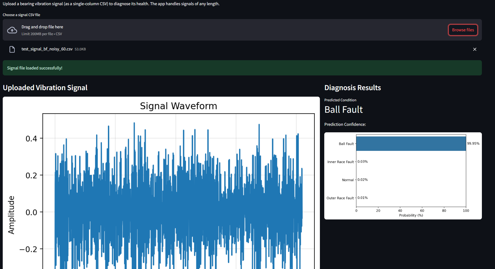

# AI-Powered Bearing Fault Diagnosis using 1D CNN

[](https://ai-bearing-diagnosis-nahmad.streamlit.app/)

## Overview

This project presents an end-to-end solution for diagnosing bearing faults using a 1D Convolutional Neural Network (CNN). The system is designed to classify the health state of bearings based on their vibration signals. It includes a complete workflow from data exploration and preprocessing to model development, training, and deployment as a user-friendly web application using Streamlit.

The primary goal is to accurately identify different types of bearing faults—such as Inner Race Fault (IRF), Ball Fault (BF), and Outer Race Fault (ORF)—along with distinguishing them from normal (healthy) bearing operations.

## Live Demo

**Try the application:** [https://ai-bearing-diagnosis-nahmad.streamlit.app/](https://ai-bearing-diagnosis-nahmad.streamlit.app/)



## Features

* **Comprehensive Data Analysis (EDA):** In-depth exploratory data analysis of the CWRU Bearing Dataset to understand signal characteristics across various load conditions
* **Signal Preprocessing:** Segmentation of raw time-series data into smaller windows to prepare it for the CNN model
* **Advanced Training Techniques:** The project explores the impact of class imbalance by training the model on both the original (imbalanced) and a synthetically balanced (using SMOTE) dataset
* **Robust 1D CNN Model:** A custom-built 1D CNN architecture is implemented using PyTorch for effective feature extraction from vibration signals
* **Interactive Web Application:** A Streamlit application provides an intuitive interface for real-time fault diagnosis. Users can upload a signal file and instantly receive a prediction about the bearing's health
* **Noise Robustness Testing:** The model's performance is evaluated against noisy signals to test its real-world applicability

## Dataset

This project utilizes the **Case Western Reserve University (CWRU) Bearing Dataset**, a well-known benchmark for bearing fault diagnosis. The dataset includes vibration signals collected from bearings operating under different load conditions (0, 1, and 2 HP) and with various induced faults.

The four bearing states analyzed are:
* Normal
* Inner Race Fault (IRF)
* Ball Fault (BF)
* Outer Race Fault (ORF)

The raw data is provided in `.mat` files and is processed and segmented in the notebooks.

## Project Structure

```
AI-Bearing-Diagnosis/
├── data/
│   ├── raw/          # Raw .mat files from CWRU
│   └── processed/    # Processed .npy files
├── figures/          # Saved plots and visualizations
├── models/           # Saved model weights
├── notebooks/
│   ├── 01_data_understanding_and_eda.ipynb
│   ├── 02_preprocessing_feature_engineering_and_augmentation.ipynb
│   ├── 03_1D_CNN_Model_Development.ipynb
│   └── 04_Inference_and_App_Development.ipynb
├── src/
│   └── data_utils.py # Utility functions for data handling
└── streamlit_app/
    ├── app.py        # The main Streamlit application
    └── test_signal_*.csv # Sample signals for testing
```

## Installation

1. **Clone the repository:**
   ```bash
   git clone <repository-url>
   cd AI-Bearing-Diagnosis
   ```

2. **Create a virtual environment (recommended):**
   ```bash
   python -m venv venv
   source venv/bin/activate  # On Windows, use `venv\Scripts\activate`
   ```

3. **Install the required dependencies:**
   ```bash
   pip install -r requirements.txt
   ```

## Usage

### Running the Notebooks

To understand the complete workflow, it is recommended to run the Jupyter notebooks in sequential order:

1. `01_data_understanding_and_eda.ipynb`
2. `02_preprocessing_feature_engineering_and_augmentation.ipynb`
3. `03_1D_CNN_Model_Development.ipynb`
4. `04_Inference_and_App_Development.ipynb`

### Running the Streamlit Application

To launch the web application for real-time diagnosis:

1. **Navigate to the app directory:**
   ```bash
   cd streamlit_app
   ```

2. **Run the Streamlit app:**
   ```bash
   streamlit run app.py
   ```

This will open a new tab in your web browser with the application interface. You can use the provided `test_signal_*.csv` files to test the diagnosis functionality.

## Model Architecture

The core of this project is a 1D Convolutional Neural Network (CNN) built with PyTorch. The architecture is specifically designed to handle time-series data and consists of:

* Multiple 1D convolutional layers for feature extraction
* Batch normalization for stabilizing training
* ReLU activation functions to introduce non-linearity
* Max pooling layers to reduce dimensionality
* A fully connected classifier with dropout for regularization

## Dependencies

The main libraries used in this project are listed in the `requirements.txt` file. Key dependencies include:

* `streamlit`
* `torch`
* `numpy`
* `pandas`
* `scikit-learn`
* `matplotlib`
* `seaborn`
* `imblearn`
* `joblib`